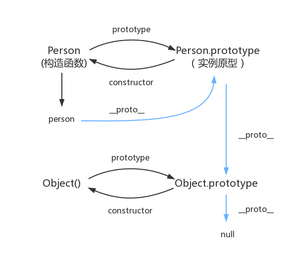

# js

## js 数据类型

JavaScript 共有八种数据类型，分别是 Number、String、Undefined、Null、Boolean、Object、Symbol、BigInt。

其中 Symbol 和 BigInt 是 ES6 中新增的数据类型：

- Symbol 代表创建后独一无二且不可变的数据类型，它主要是为了解决可能出现的全局变量冲突的问题。
  声明方法：

  ```js
  let id = Symbol("id“);
  ```

  Symbol 数据类型的特点是唯一性，即使是用同一个变量生成的值也不相等。

  ```js
  let id1 = Symbol('id');
  let id2 = Symbol('id');
  console.log(id1 == id2); //false
  ```

  Symbol 数据类型的另一特点是隐藏性，for···in，object.keys() 不能访问,虽然这样保证了 Symbol 的唯一性，但我们不排除希望能够多次使用同一个 symbol 值的情况。为此，官方提供了全局注册并登记的方法：Symbol.for()

  ```js
  let name1 = Symbol.for('name'); //检测到未创建后新建
  let name2 = Symbol.for('name'); //检测到已创建后返回
  console.log(name1 === name2); // true
  ```

  还可以使用 Symbol.keyFor()获取到全局的 Symbol 对象的参数值

  ```js
  // 创建全局符号
  let s = Symbol.for('foo');
  console.log(Symbol.keyFor(s)); // foo //
  创建普通符号;
  let s2 = Symbol('bar');
  console.log(Symbol.keyFor(s2)); // undefined
  ```

  凡是可以使用字符串或数值作为属性的地方，都可以使用符号。

  ```js
  let s1 = Symbol('foo'),
  let o = { [s1]: 'foo val' };
  // 这样也可以：o[s1] = 'foo val';
  ```

- BigInt 是一种数字类型的数据，它可以表示任意精度格式的整数， 使用 BigInt 可以安全地存储和操作大整数，即使这个数已经超出了 Number 能够表示的安全整数范围。

  可以通过 BigInt()构造函数和在整数后面加 n 的方式定义一个 BigInt：

  ```js
  let valA = 10n;
  let valB = BigInt(10);
  console.log(valA === valB); // true
  ```

这些数据可以分为原始数据类型和引用数据类型：

- 栈：原始数据类型（Undefined、Null、Boolean、Number、String）
- 堆：引用数据类型（对象、数组和函数）

两种类型的区别在于存储位置的不同：

- 原始数据类型直接存储在栈（stack）中的简单数据段，占据空间 小、大小固定，属于被频繁使用数据，所以放入栈中存储；
- 引用数据类型存储在堆（heap）中的对象，占据空间大、大小不固定。如果存储在栈中，将会影响程序运行的性能；引用数据类型在栈中存储了指针，该指针指向堆中该实体的起始地址。当解释器寻找引用值时，会首先检索其在栈中的地址，取得地址后从堆中获得实体。

堆和栈的概念存在于数据结构和操作系统内存中，在数据结构中：

- 在数据结构中，栈中数据的存取方式为先进后出。
- 堆是一个优先队列，是按优先级来进行排序的，优先级可以按照大小来规定。

在操作系统中，内存被分为栈区和堆区：

- 栈区内存由编译器自动分配释放，存放函数的参数值，局部变量的值等。其操作方式类似于数据结构中的栈。
- 堆区内存一般由开发者分配释放，若开发者不释放，程序结束时可 能由垃圾回收机制回收。

## 数据类型检测的方式

1. typeof

   typeof 只能用来判断基本数据类型，数组、对象、null 都会被判断为 object。

2. instanceof

   instanceof 可以正确判断对象的类型，其内部运行机制是判断在其原型链中能否找到该类型的原型。

   ```js
   [1,2] instanceof Array; // true
   function test () {};
   test instanceof Function; // true
   123 instanceof Number; // false
   ‘str’ instanceof String; // false
   new Number(3) instanceof Number; //true
   new String('str') instanceof String; // true
   ```

   基本数据类型只有通过对应类型构造函数创建出来成对象形式，才会是对应类型构造函数实例（true），直接写基本数据类型值则不是（false），毕竟上面有说到 instanceof 是用来判断左侧是不是右侧的实例对象，你连对象类型都不是怎么可能为 true 呢；引用类型可以直接作为左侧实例对象继承自右侧构造函数，返回值为 true。

3. constructor

   constructor 有两个作用，一是判断数据的类型，二是对象实例通过 constrcutor 对象访问它的构造函数。需要注意，如果创建一个对象 来改变它的原型，constructor 就不能用来判断数据类型了。

   ```js
   (2).constructor === Number; // true
   true.constructor === Boolean; // true
   [].constructor === Array; // true
   (function () {}.constructor === Function); // true
   ({}.constructor === Object); // true
   ```

4. Object.prototype.toString.call()

   Object.prototype.toString.call() 使用 Object 对象的原型方法 toString 来判断数据类型，可以判断："Arguments", “Array”, “Boolean”, “Date”, “Error”, “Function”, “JSON”, “Math”, “Number”, “Object”, “RegExp”, “String”，“Undefined” 和 “Null”。

   ```js
    Object.prototype.toString.call(null);// ”[object Null]”
    Object.prototype.toString.call(undefined);// ”[object Undefined]”
    Object.prototype.toString.call(“abc”);// ”[object String]”
    Object.prototype.toString.call(123);// ”[object Number]”
    Object.prototype.toString.call(true);// ”[object Boolean]”
   ```

   - 为什么需要 Object.prototype?

     Object 对象本身就有一个 toString()方法，返回的是当前对象的字符串形式，原型上的 toString()返回的才是我们真正需要的包含对象数据类型的字符串。

   - 为什么需要 call？

     由于 Object.prototype.toString()本身允许被修改，像 Array、Boolean、Number 的 toString 就被重写过，所以需要调用 Object.prototype.toString.call(arg)来判断 arg 的类型，call 将 arg 的上下文指向 Object，所以 arg 执行了 Object 的 toString 方法。

     至于 call，就是改变对象的 this 指向，当一个对象想调用另一个对象的方法，可以通过 call 或者 apply 改变其 this 指向，将其 this 指向拥有此方法的对象，就可以调用该方法了

## Object.is() 与比较操作符 “===”、“==” 的区别

使用双等号（==）进行相等判断时，如果两边的类型不一致，则会进 行强制类型转化后再进行比较。

```js
1 == '1'; // true
// 等同于1 === Number('1')
```

使用三等号（===）进行相等判断时，如果两边的类型不一致时，不 会做强制类型准换，直接返回 false。

```js
1 === '1'; // false
NaN === NaN; // false
+0 === -0; // true
```

使用 Object.is 来进行相等判断时，一般情况下和三等号的判断相 同，它处理了一些特殊的情况，比如 -0 和 +0 不再相等，两个 NaN 是相等的。

```js
Object.is(+0, -0); // false
Object.is(NaN, NaN); // true
```

## 如何判断一个对象是空对象

使用 JSON 自带的.stringify 方法来判断：

```js
if (JSON.stringify(obj) == '{}') {
  console.log('空对象');
}
```

使用 ES6 新增的方法 Object.keys()来判断：

```js
if (Object.keys(obj).length < 0) {
  console.log('空对象');
}
```

## 闭包

1. 什么是闭包？

   简单讲，闭包就是指有权访问另一个函数作用域中的变量的函数。

   闭包函数：声明在一个函数中的函数，叫做闭包函数

   ```js
   function outer() {
     var a = 1;
     return function () {
       return a;
     };
   }
   const b = outer();
   console.log(b());
   ```

2. 闭包的应用

   在函数外读取函数内部的变量；
   让局部变量的值能够被保存下来；
   将模块的公有属性和方法暴露出来。

3. 闭包的优缺点

   优点：有利于封装，可以访问到局部变量；不会污染全局变量

   缺点：闭包会使得函数中的变量被保存在内存中，增加内存消耗，不能滥用闭包，否则会造成网页的性能问题，在低版本 IE 中还可能导致内存泄露(不再用到的内存，没有及时释放)。

## 原型、原型链

1. 原型 prototype 和 \_\_proto\_\_

   - 每个构造函数都有一个 prototype 原型对象
   - 每个实例对象都有一个\_\_proto\_\_属性，并且指向它构造函数的 prototype 原型对象
   - 每个原型对象里的 constructor 指向构造函数本身

   ```js
   function Person() {}
   var person = new Person();
   console.log(person.__proto__ === Person.prototype); // true
   console.log(Person === Person.prototype.constructor); //true
   ```

2. 原型链

   Javascript 是面向对象的，每个实例对象都有一个\_\_proto\_\_属性，该属性指向它的原型对象，这个实例对象的构造函数有一个原型属性 prototype，与实例的\_\_proto\_\_属性指向同一个对象。当一个对象在查找一个属性的时，自身没有就会根据\_\_proto\_\_ 向它的原型进行查找，如果都没有，则向它的原型的原型继续查找，直到查到 Object.prototype.\_\_proto\_\_为 null，这样也就形成了原型链。

   

## 如何创建一个对象

1. 函数声明方式

```js
function 函数名(){ // 函数体代码 }
```

2. 函数表达式方式

```js
var 函数名 = function() { // 函数体代码 }
```

3. 函数对象(构造函数方式)

```js
var 变量名 = new Function("参数1","参数2",...,"函数体");
```

4. Object.create()方式

   Object.create(proto, propertiesObject)

   - proto：新创建对象的原型对象。
   - propertiesObject：一个属性描述对象，它所描述的对象属性，会添加到实例对象，作为该对象自身的属性。

   创建一个空对象：Object.create(null)

```js
var o2 = Object.create(
  {},
  {
    p: {
      value: 42, //与属性关联的值。可以是任何有效的JavaScript值（数字，对象，函数等）。 默认为 undefined
      writable: true, //true当且仅当与该属性相关联的值可以用赋值运算符改变时。 默认为 false
      enumerable: true, //true 当且仅当在枚举相应对象上的属性时该属性显现。 默认为 false
      configurable: true, //true 当且仅当该属性描述符的类型可以被改变并且该属性可以从对应对象中删除。 默认为 false
    },
  }
);
```

## JavaScript 中的作用域、预解析与变量声明提升
